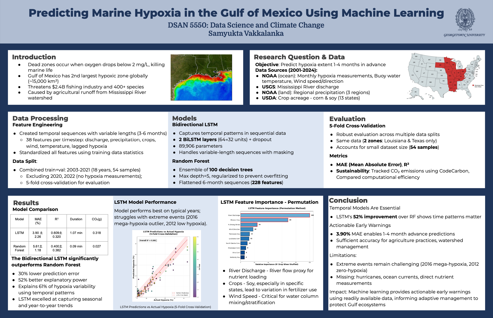

# Marine Hypoxia Analysis

From the spring through the summer in the Gulf of Mexico, scientists have measured the water having very low oxygen levels in a cycle known as hypoxia. Many species can’t survive at these levels, leaving a dead zone. The Gulf of Mexico is one of the most important regions for commercial fishing in the US, meaning that this issue has major economic and social impacts. One of the biggest reasons behind this dead zone is eutrophication, or the excess of phosphorus and nitrogen causing algal blooms. When they die and decompose, oxygen is consumed from the water, leaving little for other organisms (NOAA). Currently, many models approaching this problem restrict themselves to data about the oceans (Ahmad et al.) or they stick to predicting current conditions or short-term forecasting. By attempting to conduct long-term forecasting, new models could allow for larger scale management decisions and prevention actions. This can help decrease the ecological impact of eutrophication by saving fish or minimizing habitat loss and support commercial farming by giving a larger gap for them to adjust to future hypoxia.

NOTES:
- Tested both an lstm model and random forest
  - Because we are only predicting one value per zone per year, a traditional model was usable (independence between years, but the time series is inputted as separate features)
- Output: percent of stations in zone recording hypoxic conditions
- Data Used:
  - Hypoxia: <https://www.ncei.noaa.gov/maps/hypoxia/>
  - Corn/Soybeans: <https://quickstats.nass.usda.gov>
  - Precipitation: <https://www.ncei.noaa.gov/access/us-climate-normals/>
  - Wind: <https://www.ndbc.noaa.gov/station_history.php?station=42040>

